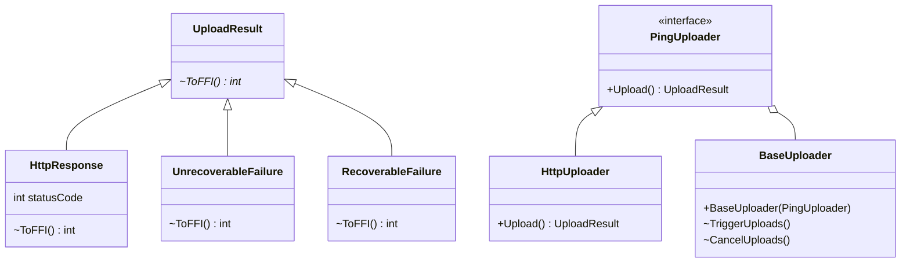
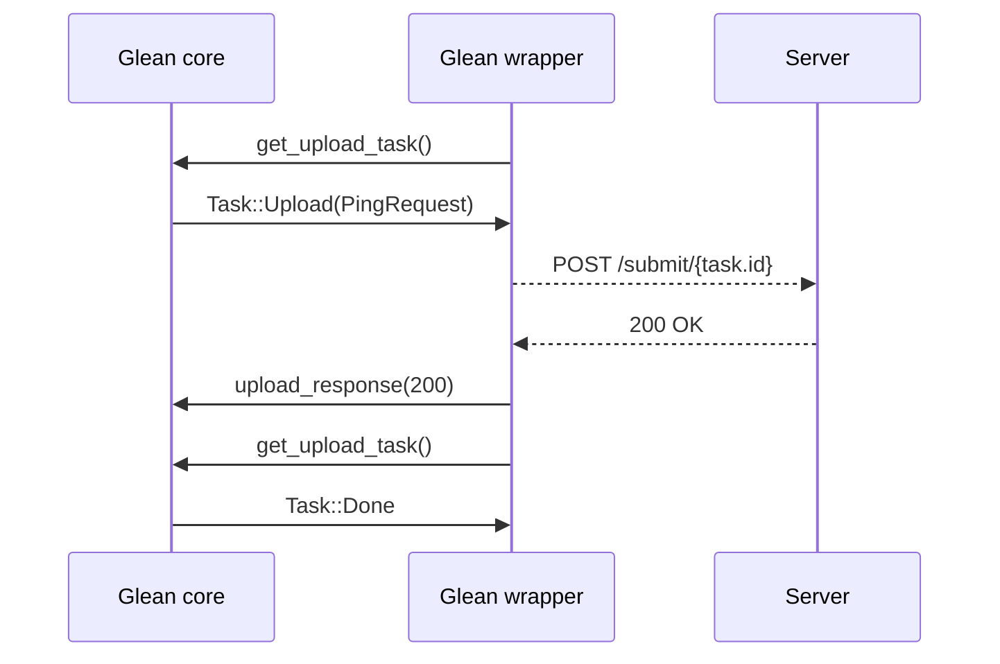

# Upload mechanism

The `glean-core` Rust crate does not handle the ping upload directly.
Network stacks vastly differ between platforms, applications and operating systems.
The Glean SDK leverages the available platform capabilities to implement any network communication.

Glean core controls all upload and coordinates the platform side with its own internals.
All language bindings implement ping uploading around a common API and protocol.

## The upload module in the language bindings



### `PingUploader`
The `PingUploader` interface describes the contract between the `BaseUploader` and the SDK or user-provided upload modules.

### `BaseUploader`
The `BaseUploader` component is responsible for interfacing with the lower level `get_upload_task` calls and dealing with the logic in a platform-coherent way.

  * Every Glean instance will always have a single `BaseUploader` instance.
  * The `BaseUploader` is fed, at Glean initialization, with an instance of an implementation of the `PingUploader` interface.
  * Whenever `BaseUploader` thinks it should perform an upload, it will call the provided instance of the `PingUploader` interface and call `upload` with the data it's getting from the glean-core/FFI.
  * Any throttling happens at this layer: the core will orchestrate the throttling, while this layer will be responsible to abide to what the core is telling it to do.
  * Any logic for aborting uploads or triggering uploads is provided by this object.

### `HttpClientUploader`
The `HttpClientUploader` is the default SDK-provided HTTP uploader. It acts as an adapter between the platform-specific upload library and the Glean upload APIs.

> Note that most of the languages have now diverged, due to the many iterations, from this design. For example, in Kotlin, the [`BaseUploader` is mostly empty](https://searchfox.org/glean/source/glean-core/android/src/main/java/mozilla/telemetry/glean/net/BaseUploader.kt) and its functionalities are spread in the [`PingUploadWorker`](https://searchfox.org/glean/source/glean-core/android/src/main/java/mozilla/telemetry/glean/scheduler/PingUploadWorker.kt).

## Upload task API

The following diagram visualizes the communication between Glean core (the Rust crate),
a Glean language binding (e.g. the Kotlin or Swift implementation) and a Glean end point server.



Glean core will take care of file management, cleanup, rescheduling and rate limiting.

## Policies

The uploading functionality works based on a series of policies to keep resource usage in check and avoid infinite upload failure loops.

Currently there are no exposed ways for bindings to change this upload policies for testing purposes or otherwise (follow [Bug 1664217](https://bugzilla.mozilla.org/show_bug.cgi?id=1664217) for updates).

### Rate limiting

Rate limiting is achieved by limiting the amount of times a language binding is allowed to get a `Task::Upload(PingRequest)` from `get_upload_task` in a given time interval. Currently, the default limit is for a maximum of 15 upload tasks every 60 seconds and there are no exposed methods that allow changing this default (follow [Bug 1647630](https://bugzilla.mozilla.org/show_bug.cgi?id=1647630) for updates). If the caller has reached the maximum tasks for the current interval, they will get a `Task::Wait(u32)` regardless if there are other `Task::Upload(PingRequest)`s queued.

### Ping payload

The payload of a ping request is limited to a maximum of 1MB. If a `PingRequest` is created that exceeds this limits, it is discarded before being enqueued for upload.

### Pending pings folder

The pending pings folder is also limited to a maximum of 10MB. Everytime the upload manager is initialized, it calculates the size of this folder and, in case the limit has been reached, the oldest pings are discarded until the folder reaches an acceptable size again.

> **Note** The deletion request pings are stored in a different folder from ordinary pings and are never discarded.

### Backoff policy

A caller may receive a `Task::Wait(u32)` response from `get_upload_task` either when glean-core is not finished scanning pendings pings directories or when the rate limit has been reached.

The `Task::Wait(u32)` response carries a `u32` which signifies the amount of seconds the caller should wait before calling `get_upload_task` again. This amount starts at 10 seconds and increases exponentially by a power of two everytime we get a `Task::Wait(u32)` response in a row. If we get either `Task::Upload(PingRequest)` or `Task::Done` the backoff time is reset back to its minimum value.

Another limitation imposed by the core, is that a caller is only allowed to get up to three `Task::Wait(u32)` responses in a row. When this limit is reached, the called gets a `Task::Done` and should stop making requests.

> **Note** In Android, the `PingUploadWorker` is built on top of Android's [`WorkManager`](https://developer.android.com/jetpack/androidx/releases/work), which already has it's own backoff policy. This means that, in Android, we dismiss the wait time provided by the glean-core. Intentionally, the intervals calculated by the `WorkManager`s policy are the same as the ones calculated by the core, thus making the backoff delays standardized throughout all bindings.

## Available APIs

{{#include ../../../tab_header.md}}

<div data-lang="Rust" class="tab">

For direct Rust consumers the global `Glean` object provides these methods:

```rust
/// Gets the next task for an uploader.
fn get_upload_task(&self) -> PingUploadTask

/// Processes the response from an attempt to upload a ping.
fn process_ping_upload_response(&self, uuid: &str, status: UploadResult)
```

See the documentation for further usage and explanation of the additional types:

* [`get_upload_task`](../../../../docs/glean_core/struct.Glean.html#method.get_upload_task)
* [`process_ping_upload_response`](../../../../docs/glean_core/struct.Glean.html#method.process_ping_upload_response)
* [`PingUploadTask`](../../../../docs/glean_core/upload/enum.PingUploadTask.html)
* [`UploadResult`](../../../../docs/glean_core/upload/enum.UploadResult.html)

</div>

<div data-lang="FFI" class="tab">

For FFI consumers (e.g. Kotlin/Swift/Python implementations) these functions are available:

```rust
/// Gets the next task for an uploader. Which can be either:
extern "C" fn glean_get_upload_task(result: *mut FfiPingUploadTask)

/// Processes the response from an attempt to upload a ping.
extern "C" fn glean_process_ping_upload_response(task: *mut FfiPingUploadTask, status: u32)
```

See the documentation for additional information about the types:

* [`glean_ffi::upload`](../../../../docs/glean_ffi/upload/index.html)

</div>

{{#include ../../../tab_footer.md}}
